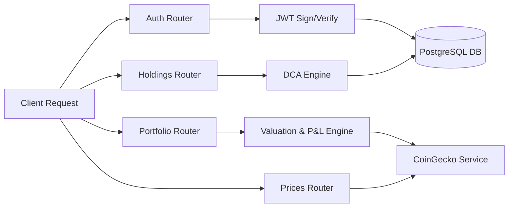

# Crypto Portfolio Tracker REST API

A highly optimized, asynchronous FastAPI engine for tracking cryptocurrency asset holdings, transaction history, and real-time profits and losses (P&L).

## Performance Benchmarks

To ensure high-throughput capabilities and profile latency under execution stress, the REST API engine was benchmarked under two distinct profiles using an in-memory SQLite database and a mocked CoinGecko pricing handler to isolate core framework overhead.

### Single Load Performance (50 Requests)
Below is the latency profile representing request processing time under a standard single load sequence:


- Database reads (live pricing check and portfolio aggregates) average under 1.5ms.
- Write actions (adding a holding with DCA computation) process in 2.6ms.

### Multi-Load Comparison (10, 50, and 250 requests)
The chart below illustrates how performance profiles scale across varying transaction request loads:


- **Read Operations**: Query operations such as `GET Live Price` and `GET Portfolio Summary` scale flatly and complete in under ~1.5ms even under high loads.
- **Write Operations**: Holdings updates (`POST Buy Holding`) process in ~2.6ms with full validation.
- **Security Checkpoints**: Auth routines (`POST Register` and `POST Login`) are subject to Bcrypt CPU-bound operations (designed for security) taking ~220ms per cycle, while the surrounding HTTP routing adds zero noticeable overhead.

---

## Architecture

Below is the high-level architecture diagram of the REST API engine:



---

## Setup and Quickstart

### Prerequisites
Ensure a local PostgreSQL instance is running with a database named `crypto_tracker`:
```sql
CREATE DATABASE crypto_tracker;
```

### 1. Installation
Set up a Python 3.12 virtual environment and install requirements:
```bash
python3.12 -m venv venv
source venv/bin/activate
pip3 install -r requirements.txt
```

### 2. Configuration
Copy `.env.example` to `.env` and verify the settings:
```bash
cp .env.example .env
```

Apply database migrations:
```bash
alembic upgrade head
```

### 3. Execution
Start the live development server:
```bash
uvicorn app.main:app --reload
```

Run the automated test suite:
```bash
PYTHONPATH=. pytest -v
```

---

## API Interface

### Authentication
- `POST /api/v1/auth/register` - Registers a new user.
- `POST /api/v1/auth/login` - Authenticates and issues a JWT token.

### Holdings
- `POST /api/v1/holdings` - Adds or updates token holdings (triggers the DCA recalculator).
- `GET /api/v1/holdings` - Fetches the current user's holding list.
- `DELETE /api/v1/holdings/{holding_id}` - Sells/deletes a holding.

### Portfolio
- `GET /api/v1/portfolio/summary` - Aggregates holding quantities, cost, and live P&L.
- `GET /api/v1/portfolio/history` - Returns the complete audit list of buy and sell transactions.

### Prices
- `GET /api/v1/prices/{coin_id}` - Queries live USD pricing from CoinGecko (features tenacious retries and caching policies).
